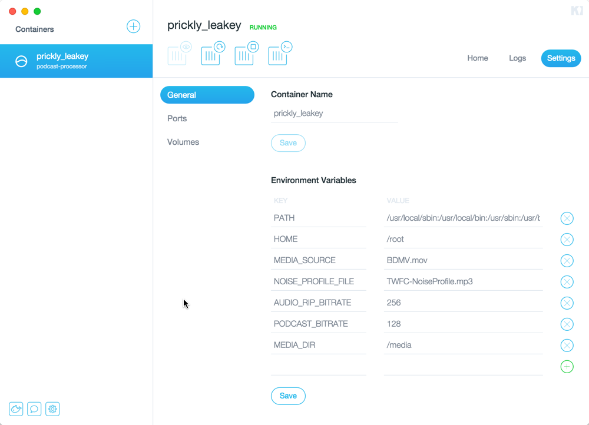
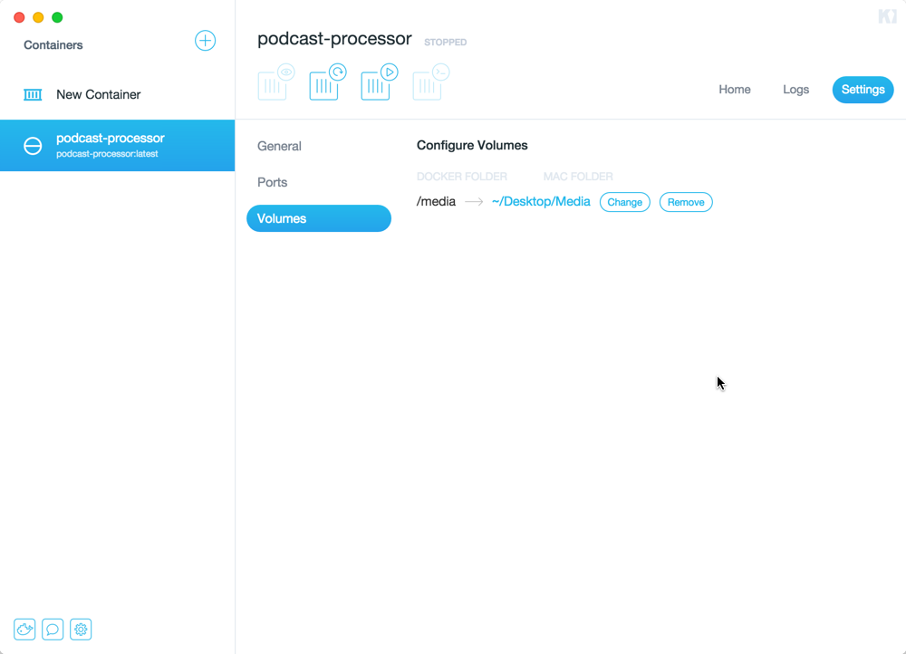

# podcast-processor

This docker/vagrant/bash script setup is intended to manage the process of extracting audio from a video file, normalizing and recombining the video file with the updated audio.  It also outputs an MP3 for use in podcasting.  Using it's pretty simple:

* Download and install [Kitematic](https://kitematic.com/download/) on your Mac
* Add a container from the repository [patrickmcclory/podcast-processor](https://registry.hub.docker.com/u/patrickmcclory/podcast-processor/)
* Edit the following settings for the container

  * Environment Variables
    * MEDIA_SOURCE - name of the video file within the volume mounted that is the source for this proces
    * NOISE_PROFILE_FILE - name of the mp3 file within the volume mounted that is the noise profile for processing the audio
    * AUDIO_RIP_BITRATE - bitrate at which to rip audio from the source video file
    * PODCAST_BITRATE - bitrate at which to encode the file to post for podcasting
    * MEDIA_DIR - this is the mount point within the container where your media is accessible through

  * Volumes
    * Map the /media path to the folder where your video source and noise profile are sitting - these need to be in the same folder.
